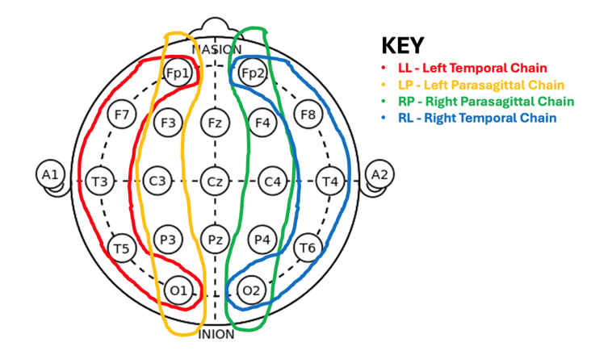
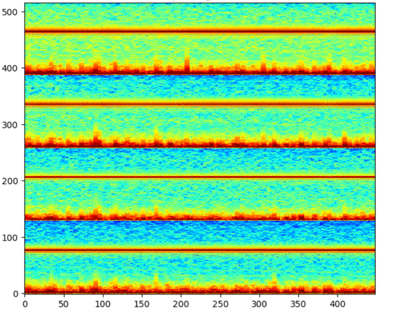

# **Kaggle：脑部疾病分类和预测竞赛:HMS-Harmful Brain Activity Classification**

## 比赛结果：排名top 1.5%，获得银牌。

  

成员：laplace\_zfg，noshakeplz，Emily，Yinghao，Wang。

作者（laplace\_zfg）主要负责其中1D CNN+GRU和2D EfficientNet融合的多模态模型（多模态数据见后续，分为1D eeg与 2D spec）

## 项目背景：

根据病人的脑电波时序信号数据以及对应的频谱图数据对其预测和分类癫痫发作以及其他类型的有害脑活动，共6类。

## **项目方案：**

数据预处理：通过数据EDA，发现数据中存在重复的相似数据，对重复的数据进行删除。同时发现数据中脑电图和频谱图都存在缺失值，对这些缺失值的数据进行删除。最终处理后的训练数据共20183行，每个样本均对应唯一的原始时序数据、频谱图数据。

## **特征工程：**

依据专家经验对脑波时序数据进行通道筛选和作差，来反映不同脑区域活动信号，每个模型采用不同的数据处理方式。

### **模型一、二的数据：**

1，官方的每条50s脑电波数据转为频谱图（raw eeg -> eeg to spec）

将各电极的脑电波数据分为4个区域（因为官方的频谱图也为纵向4个区域对应4个电极区），每个区域脑电波数据相邻做差；

4个区域的脑电波数据再通过librosa转为4个梅尔频谱图，尺寸为（128，256，4）（其他的也尝试过，针对此处转为梅尔频谱图，效果更好），纵向拼接得到最终频谱图eeg to spec尺寸为（512，256）。

2，官方的每条10min频谱图数据

将官方频谱图像kaggle spec对数归一化，分割为（100，300，4），每行间隔14个像素的距离，纵向拼接，并resize为（512，256）。

3，将1与2横向拼接组合为（512，512）大小的组合频谱图，此时频谱图从上至下分别为四个电极区对应的频谱。

  

### **模型三、四、五的数据：**

1，主要将官方的脑电波数据转为频谱图数据（eeg to spec），转换处理的流程与模型一的1部分类似。

2，将各电极的脑电波数据分为4个区域（因为官方的频谱图也为纵向4个区域对应4个电极区），每个区域内若干脑电波数据相邻做差，得到的每个区域含有的4个脑电波。

3，4个区域，每个区域4个脑电波数据通过scipy.signal模块的傅里叶变换完成转换。每个区域的频谱为该区域的4个频谱的平均频谱。最终纵向拼接得到（512，512）大小的频谱图。

  
  

### **模型六的数据：**

1，采用与模型三、四、五相同的数据转换方式。

2，提取官方eeg 50S的脑电波数据进行转换得到（516，448）大小的频谱图。

3，提取官方eeg 中心10S的脑电波数据进行转换得到（516，108）大小的频谱图。

4，左右拼接得到（516，533），并resize为（512，512）。

  

### **模型七的数据：**

采用原始的raw eeg 20个电极的相邻电极脑电波数据做差，通过巴特沃斯带通滤波器低通滤波处理得到（10000，18）即为50s的18个特征的脑电波数据。

  

### **模型八的数据：**

**2D数据：**

1，官方的10min 频谱图（400，300），resize为（300，400）。

2，将官方的50s脑电波数据分为4个电极区（与上述相同），并分别转为频谱图（267，501，4），纵向拼接得到（501，1068），resize为（400，800）。

3，提取2中的中心官方脑电波数据的中心10s，同等方法转为频谱图（100，291，4），纵向拼接得到（291，400），resize为（300，400）。

4，合并1、2、3的频谱图数据（（300，400）、（300，400）、（400，800））得到zoom spec。具体为三部分拼接得到（800，700），resize为（512，512）。

5，将上述提取的官方的spec（128，256，4）、频谱转换的梅尔频谱eeg to spec（128，256，4）、4中合成的zoom spec（512，512）、频谱转换的scipy.signal模块的傅里叶变换得到eeg to spec\_2（512，512）。

6，将其中的spec（128，256，4）与eeg to spec（128，256，4）左右拼接得到（512，512）；将其与zoom spec（512，512）、eeg to spec\_2（512，512），转为channel first ，并在第一维度堆叠得到（1，1536，512），第0维度堆叠3次得到2D spec（3，1536，512）。

  

**1D数据：**

1，官方的eeg数据（10000，20）分为4个区域，每个区域相邻电极做差。

2，对数据滤波处理得到1D eeg（10000，8）即为50s的8个特征的脑电波数据。

  

## **模型构建：**

使用了包括EfficientNetV2、EfficientNet\-B4、EEGNet、搭配不同的数据，共训练了7个模型，以及1D CNN+GRU和2D EfficientNet融合的多模态模型，共计8个模型进行融合。

### **第一部分（模型一、二）：**

模型一：eeg to spec （512，512）图像数据（归一化去除异常数值处理过）训练EfficientNetV2模型。

模型二：eeg to spec（512，512）图像数据，训练EfficientNetV2模型。

### **第二部分（模型三、四、五）：**

模型三、四：eeg to spec（512，512）（数据增强/未增强处理），训练两个EfficientNetV2模型，并融合（后续实验表明融合效果比单个效果好）

模型五：eeg to spec（512，512）（数据增强），训练EfficientNet-B4模型

### **第三部分（模型六）：**

50s与10s 拼接的 eeg to spec 频谱数据（512，512），训练EfficientNetV2模型

### **第四部分（模型七）：**

官方的的raw eeg 数据，训练EEGNet模型

### **第五部分（模型八）：（个人主要负责的部分）**

2D spec（3，1536，512）频谱图数据与1D eeg（10000，8）时序数据，训练1D CNN+GRU和2D EfficientNet\-B0融合的多模态模型。1D卷积配合GRU时序层的子模型用于学习脑波时序数据的特征，2D EfficientNet\_b0用于捕获频谱图数据的特征，相较于原始时序数据，其频谱图数据包含了额外的频域数据信息，利用CNN网络有效学习。选择EfficientNet主要原因为不容易在较小的数据上过拟合，且验证后效果好于其他CNN和Transformer模型。最终将两个子网络的全连接层输出结果使用attention注意力机制进行特征融合，用来实现多模态网络之间的特征互补。

#### 多模态融合过程：

1，1D eeg（10000，8）时序数据------>1D CNN+GRU------>feature1------>分类头1

2，2D spec（3，1536，512）频谱图数据------>2D EfficientNet\-B0------>feature2------>分类头2

3，feature1 + feature2------> IAFF多模态融合------>feature3------>分类头3

4，分类头1、2、3的结果CV交叉验证，根据CV值决定分类头1、2、3结果（result1-3）的权重值（w）

5，模型8最终结果：result = w1result1 + w2result2 + w3result3  ( w1+w2+w3 = 1)

## **训练代码：**

**efficientnetb4: efficientnetb4预训练模型文件**

**tf\_efficientnet\_b0.ns\_jft\_in1k: efficientnetb0模型文件**

**tf\_efficientnetv2\_s.in21k\_ft\_in1k: efficientnetv2模型文件**

**main\_code:训练代码**

**data\_convert:数据转换处理代码**

## **训练环境：** 

		云服务器aotudl A40 80G内存 48G显存 15核心CPU

## **模型训练：**

交叉验证：为了避免模型过拟合训练数据集，基于患者ID采用了GroupKfold进行了5/10折交叉验证数据集划分。

采用了OneCycleLR学习率迭代器以及AdamW优化器进行模型训练(早停法实验证明的最佳epoch)。实施两阶段训练，在第一阶段对ground truth置信度较低的数据进行初步训练；在第二阶段针对置信度较高的数据执行更深层次的训练。以此提高模型的泛化能力和精度，从而强化模型对于高置信度的数据的拟合效果。最终将不同模型，不同数据训练得到的8个模型结果进行集成，得到最优的方案。

## 总结：

评价指标是Kullback-Leibler散度。使用Kullback-Leibler（KL）散度来评价预测概率分布和真实概率分布之间的差异。KL散度衡量两个概率分布之间的相对熵

